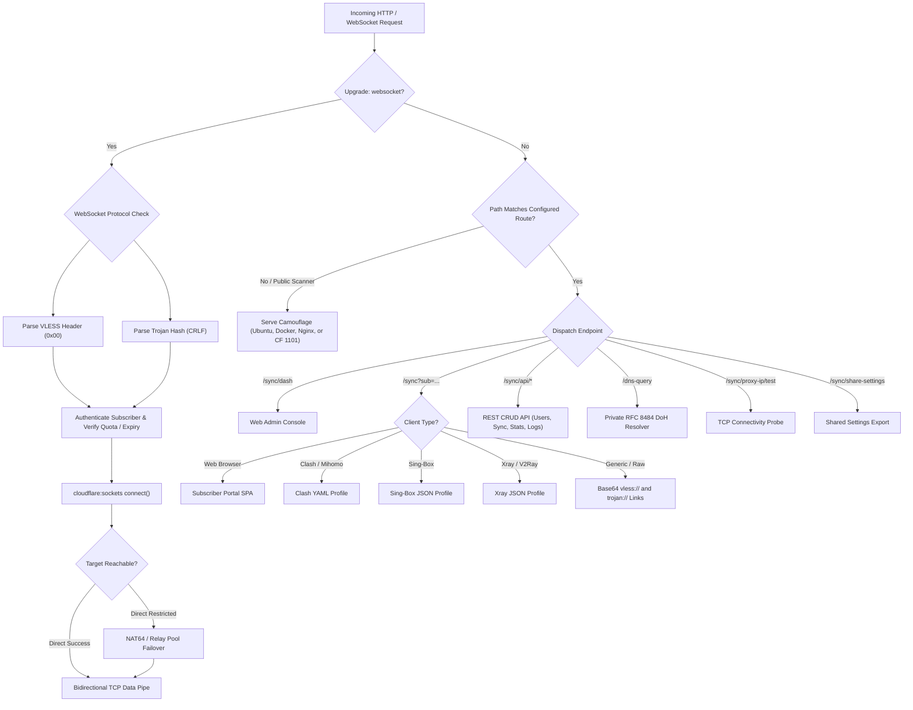

# LuciProxy — System Architecture & Technical Design

> **LuciProxy Architecture Specification**

LuciProxy is an edge-native reverse proxy panel, multi-user traffic accounting engine, and multi-format subscription gateway engineered to execute inside Cloudflare's serverless V8 Isolate edge environment.

---

## 1. System Overview & Architecture Layers

LuciProxy operates across three core architectural tiers:

```
+-------------------------------------------------------------------------+
|                  Tier 3: Protocol & Subscription Services               |
|  - VLESS & Trojan Edge Demultiplexers (0-RTT Early Data over WebSocket) |
|  - Modern Outbound Builders: Sing-Box (1.9+/1.14+), Clash, Xray, URI    |
|  - Obfuscated WireGuard & AmneziaWG (.conf) Profile Generation          |
|  - Private RFC 8484 DNS-over-HTTPS (DoH) Resolver (/dns-query)          |
|  - Network Policy Filters: QUIC/UDP-443 Dropping, AI & Dev Route Bypasses|
+-------------------------------------------------------------------------+
                                    ^
                                    |
+-------------------------------------------------------------------------+
|                Tier 2: Edge Camouflage & Network Resilience             |
|  - Multi-Carrier Clean IP Routing (ASN-based Edge Mapping)              |
|  - Low-Latency In-Browser Clean-IP Scanner                              |
|  - Authentic Reverse-Proxy Camouflage (Ubuntu, Docker, Nginx, CF 1101)  |
|  - Dynamic RFC 3986 Bracketed IPv6 Formatting & RFC 6052 NAT64 Fallback |
|  - VPS Backend Shield Mode & Live Edge Health Probing                   |
|  - Automated Zero-Downtime Secret Path Rotation                         |
+-------------------------------------------------------------------------+
                                    ^
                                    |
+-------------------------------------------------------------------------+
|             Tier 1: Core Foundation & Multi-User State Engine           |
|  - Standard Cloudflare Workers V8 Isolate Architecture (ES Modules)     |
|  - Relational Cloudflare D1 SQLite Persistence (kv_store Engine)        |
|  - Volumetric Byte-Accurate Accounting & Expiry Lockout Engine          |
|  - Native TCP Socket Streaming via cloudflare:sockets API               |
|  - Relay Health Monitoring, Quarantine, and Multi-Hop Failover          |
|  - Responsive Single-Page Application Admin Console & Subscriber Portal |
+-------------------------------------------------------------------------+
```

---

## 2. Serverless Runtime & Cloudflare Bindings

LuciProxy runs entirely within Cloudflare's global edge network without requiring persistent server daemons or external database servers.

### 2.1 Bindings Specification

| Binding Name | Type | Purpose | Fallback / Behavior |
| :--- | :--- | :--- | :--- |
| `IOT_DB` (or `DB`) | Cloudflare D1 (SQLite) | Relational configuration, subscriber metadata, usage accounting | Required for production persistence. Auto-initialized on first request. |
| `DASHBOARD_URL` | Environment Variable (string) | Custom dashboard UI override | Allows loading an external HTML dashboard if desired. |
| `SUBSCRIPTION_URL`| Environment Variable (string) | Custom subscription UI override | Allows loading an external HTML subscriber template. |
| `RELAY_IP` | Environment Variable (string) | Default outbound proxy relay | Used for outbound TCP failover when direct egress is restricted. |

### 2.2 Relational D1 Persistence Architecture

To eliminate external database latency and Cloudflare KV daily write throttles, LuciProxy stores all runtime state in Cloudflare D1:
- Primary Table: `kv_store(key TEXT PRIMARY KEY, value TEXT)`
- In-memory cache layer with adaptive Time-to-Live (TTL):
  - `sys_config`: Global configuration, master key, user list (TTL: 10 seconds)
  - `sys_usage`: Real-time byte counters per subscriber (TTL: 10 seconds)
  - `backup_ip`: Validated healthy relay endpoints (TTL: 30 seconds)
  - `system_logs`: Audit actions and diagnostic events

---

## 3. Request Routing Pipeline & Camouflage

Incoming HTTP and WebSocket requests pass through a multi-stage classification pipeline:



---

## 4. Protocol Demultiplexing & Socket Management

### 4.1 VLESS Stream Processing
1. Client initiates TLS handshake with the Cloudflare edge on port 443.
2. HTTP 101 Switching Protocols upgrades connection to WebSocket.
3. 0-RTT early data is extracted from the `Sec-WebSocket-Protocol` header if present.
4. The first binary chunk is parsed:
   - Byte 0: Version (`0x00`)
   - Bytes 1–17: 16-byte UUID
   - Byte 18: AddrType (IPv4, Domain, or IPv6)
   - Followed by destination address and port.
5. The UUID is matched against active profiles in the D1 state store.
6. A direct outbound TCP connection is established via `cloudflare:sockets.connect()`.

### 4.2 Trojan Stream Processing
1. Trojan requests arrive with a 56-byte SHA-224 password hash followed by CRLF (`\r\n`).
2. The hash is validated against SHA-224 hashes computed from active subscriber credentials.
3. Target address and port are extracted and piped directly to outbound TCP sockets.

### 4.3 Network Format Compliance
- **IPv6 Literals**: Standardized as `[ipv6]:port` per RFC 3986 to prevent URL parser corruption.
- **NAT64 Prefixing**: Standardized as hexadecimal mapping per RFC 6052 for IPv6-only edge nodes.
